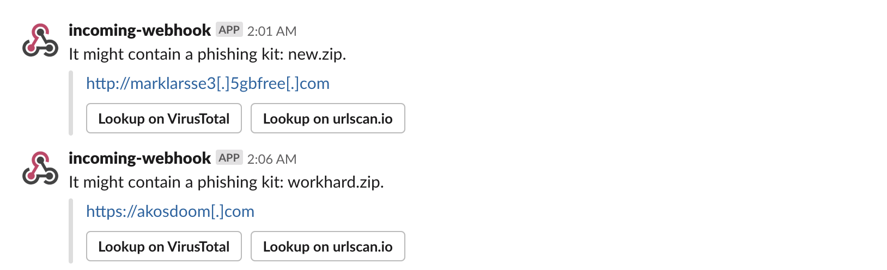

# Miteru

[](https://badge.fury.io/rb/miteru)
[](https://travis-ci.com/ninoseki/miteru)
[](https://hub.docker.com/repository/docker/ninoseki/miteru)
[](https://www.codefactor.io/repository/github/ninoseki/miteru)
[](https://coveralls.io/github/ninoseki/miteru?branch=master)

Miteru is an experimental phishing kit detection tool.

## How it works

- It collects phishy URLs from the following feeds:
  - [CertStream-Suspicious feed via urlscan.io](https://urlscan.io/search/#certstream-suspicious)
  - [OpenPhish feed via urlscan.io](https://urlscan.io/search/#OpenPhish)
  - [PhishTank feed via urlscan.io](https://urlscan.io/search/#PhishTank)
  - [URLhaus feed via urlscan.io](https://urlscan.io/search/#URLHaus)
  - urlscan.io phish feed (available for Pro users)
  - [Ayashige feed](https://github.com/ninoseki/ayashige)
- It checks each phishy URL whether it enables directory listing and contains a phishing kit (compressed file) or not.
  - Note: compressed file = `*.zip`, `*.rar`, `*.7z`, `*.tar` and `*.gz`.

## Features

- [x] Phishing kit detection & collection.
- [x] Slack notification.
- [x] Threading.

## Installation

```bash
gem install miteru
```

## Usage

```bash
$ miteru
Commands:
  miteru execute         # Execute the crawler
  miteru help [COMMAND]  # Describe available commands or one specific command
```

```bash
$ miteru help execute
Usage:
  miteru execute

Options:
  [--auto-download], [--no-auto-download]              # Enable or disable auto-download of phishing kits
  [--ayashige], [--no-ayashige]                        # Enable or disable ayashige(ninoseki/ayashige) feed
  [--directory-traveling], [--no-directory-traveling]  # Enable or disable directory traveling
  [--download-to=DOWNLOAD_TO]                          # Directory to download file(s)
                                                       # Default: /tmp
  [--post-to-slack], [--no-post-to-slack]              # Post a message to Slack if it detects a phishing kit
  [--size=N]                                           # Number of urlscan.io's results. (Max: 10,000)
                                                       # Default: 100
  [--threads=N]                                        # Number of threads to use
  [--verbose], [--no-verbose]
                                                       # Default: true

Execute the crawler
```

```bash
$ miteru execute
...
https://dummy1.com: it doesn't contain a phishing kit.
https://dummy2.com: it doesn't contain a phishing kit.
https://dummy3.com: it doesn't contain a phishing kit.
https://dummy4.com: it might contain a phishing kit (dummy.zip).
```

## Using Docker (alternative if you don't install Ruby)

```bash
$ docker pull ninoseki/miteru
# ex. auto-download detected phishing kit(s) into host machines's /tmp directory
$ docker run --rm -v /tmp:/tmp ninoseki/miteru execute --auto-download
```

## Configuration

For using `--post-to-slack` feature, you should set the following environment variables:

- `SLACK_WEBHOOK_URL`: Your Slack Webhook URL.
- `SLACK_CHANNEL`: Slack channel to post a message (default: "#general").

If you are a urlscan.io Pro user, set your API key as an environment variable `URLSCAN_API_KEY`.

It enables you to subscribe the urlscan.io phish feed.

## Examples

### Aasciinema cast

[](https://asciinema.org/a/hHpkHhMLiiv17gmdRhVMtZWwM)

### Slack notification



## Alternatives

- [t4d/StalkPhish](https://github.com/t4d/StalkPhish): The Phishing kits stalker, harvesting phishing kits for investigations.
- [duo-labs/phish-collect](https://github.com/duo-labs/phish-collect): Python script to hunt phishing kits.
- [leunammejii/analyst_arsenal](https://github.com/leunammejii/analyst_arsenal): A tool belt for analysts to continue fighting the good fight.
